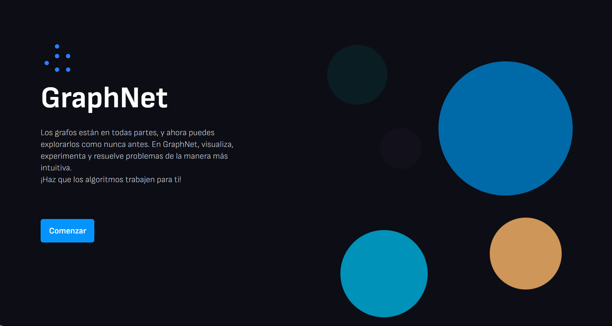
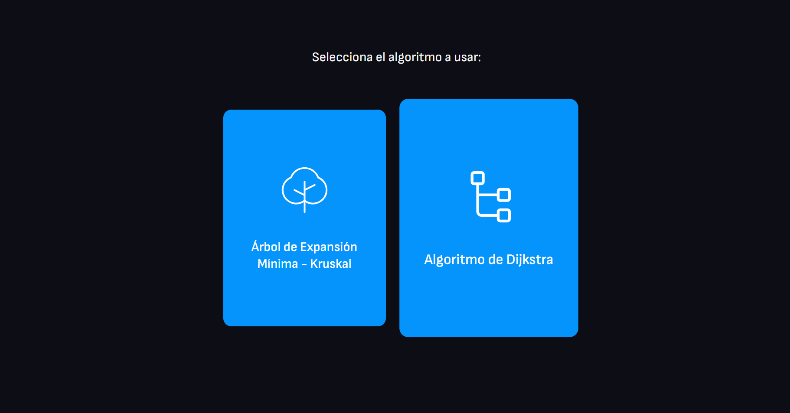
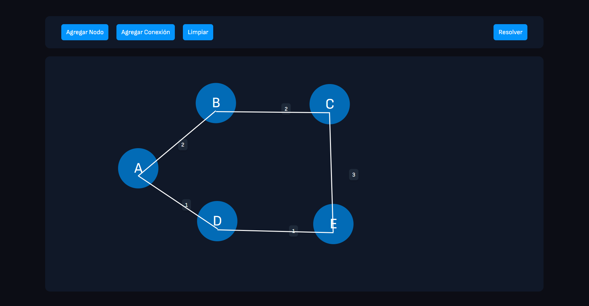
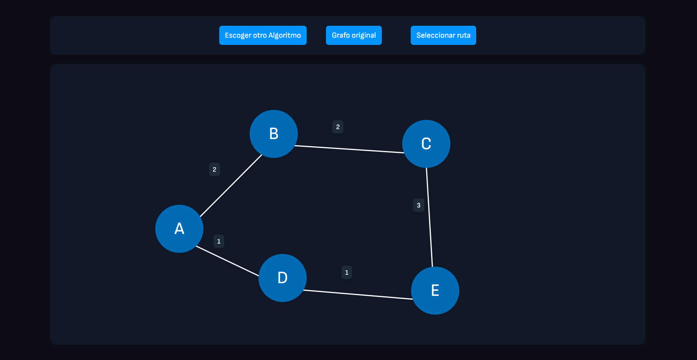

## GRAPHNET


  



GraphNet is a visual graph calculator that allows users to create, edit, and analyze graphs interactively. It includes various graph algorithms, although currently, only two have been implemented. The project aims to provide an intuitive and educational tool for understanding graph theory.

## Screenshots

**Step 1: Select the algorithm**  
Here you can choose the algorithm you will use, at the moment there are two options:



**Step 2: Example of a Graph**  
You can visually design the graph you will use with nodes, connections and weights:



**Step 3: Example of a solution**  
By clicking on “solve” you will be able to see the solution of the graph:



---

## Technologies

GraphNet uses the following open-source technologies:

- **React with TypeScript** - The front-end framework used to build the interactive graph calculator.

## Installation

Download the project and compile it with the IDE mentioned above, or use the executable.


```sh
git clone https://github.com/Luis3Fernando/GraphNet

cd Graphnet

npm install

npm run dev

```

## Live Demo
You can try GraphNet online at the following link:

https://graphnet.sysari.net/

Explore graph algorithms interactively and visualize their behavior in real-time!


