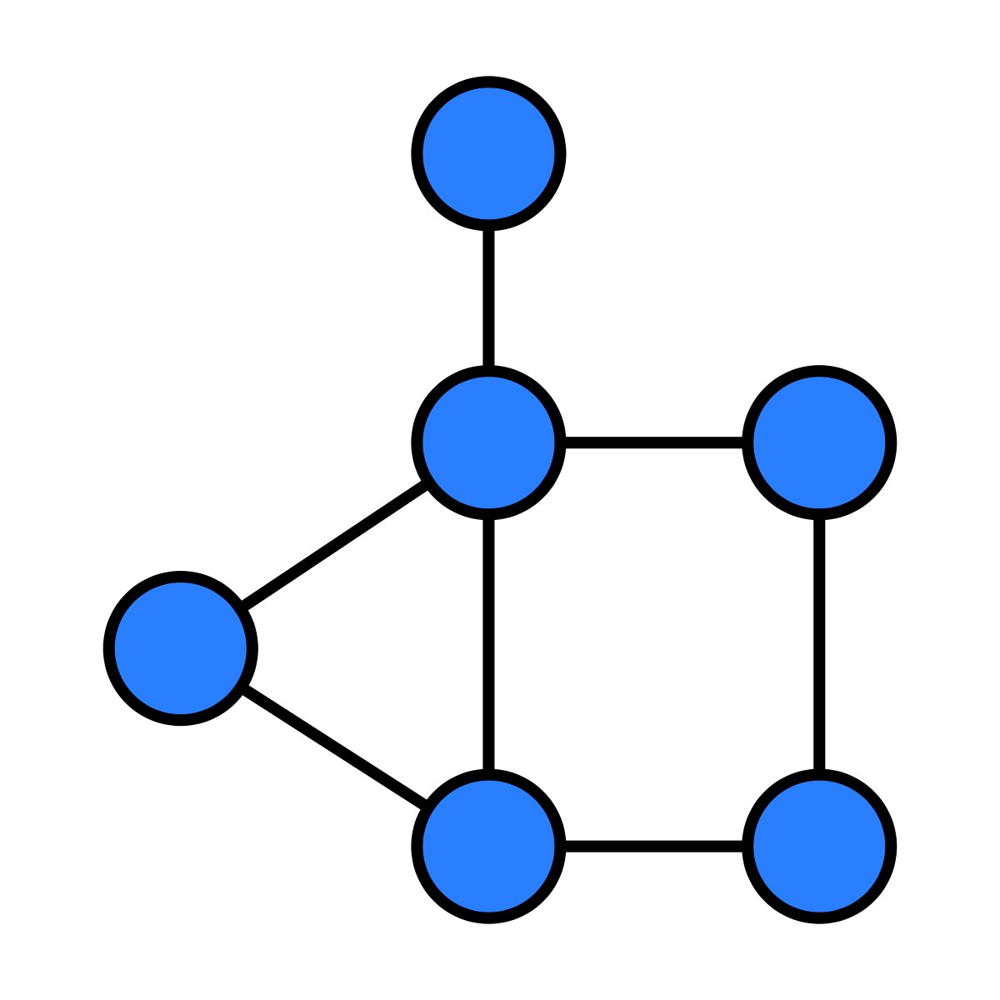

## SNAKE



 ) 


GraphNet is a visual graph calculator that allows users to create, edit, and analyze graphs interactively. It includes various graph algorithms, although currently, only two have been implemented. The project aims to provide an intuitive and educational tool for understanding graph theory.


## Technologies

GraphNet uses the following open-source technologies:

- **React with TypeScript** - The front-end framework used to build the interactive graph calculator.

## Installation

Download the project and compile it with the IDE mentioned above, or use the executable.


```sh
git clone [https://github.com/Luis3Fernando/Snake](https://github.com/Luis3Fernando/GraphNet)
```

## Live Demo
You can try GraphNet online at the following link:

https://graphnet.sysari.net/

Explore graph algorithms interactively and visualize their behavior in real-time!


